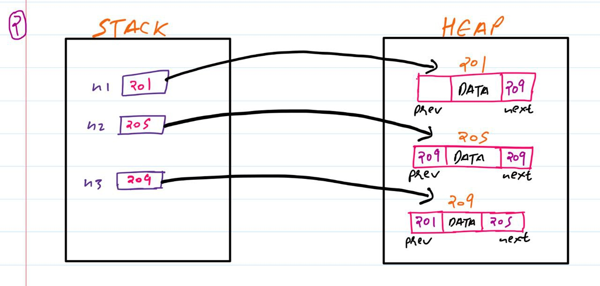
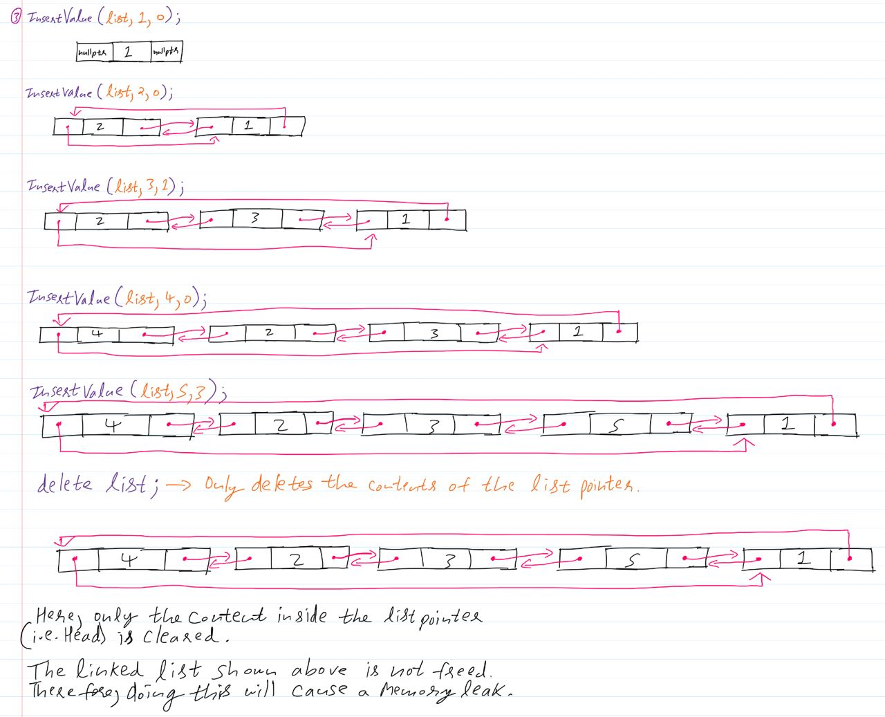

# LINKED DATA REPRESENTATION
## CHALLENGE QUESTIONS
### Question 1

```
Draw the node structures of variables a, b, and c with their value and memory address (you can assign memory locations any way, as long as it’s consistent) as they change. Provide the output resulting from the "cout" instructions.

int a = 1;
int *b = &a;
int **c = &b;
int *d = b;

cout << "a=" << a << endl;
cout << "(*c)=" << (*c) << endl;
c = &d;
(**c) = 3

cout << "(*b)=" << (*b) << endl;
cout << "(*c)=" << (*c) << endl;
cout << "(**c)=" << (**c) << endl;
```


### Question 2

```
Draw the node structure resulting from the following code:

Node* n1 = new Node();
Node* n2 = new Node();
Node* n3 = new Node();

n1->next = n3; n3->prev = n1;
n3->next = n2; n2->prev = n3;
n2->next = n1->next->next->prev;
```




### Question 3

```
Assume you have the following function that creates and inserts a node given a value
before the element at a specified position in the list:

void InsertValue(LinkedList* list, DataType_t val, int position);

Note that a position of 0 inserts it at the start. Draw the resulting doubly linked list
in each of the following steps:

LinkedList* list = new LinkedList;
InsertValue(list, 1, 0);
InsertValue(list, 2, 0);
InsertValue(list, 3, 1);
InsertValue(list, 4, 0);
InsertValue(list, 5, 3);
delete list;
```

