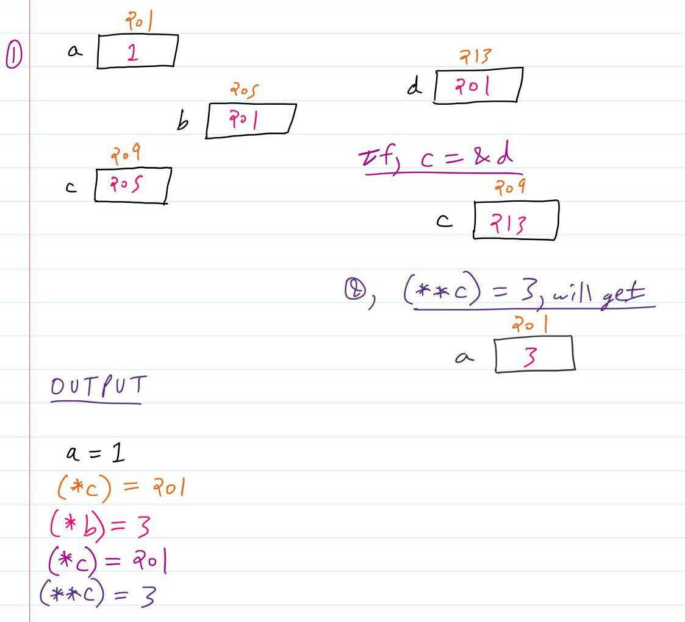

# LINKED DATA REPRESENTATION
## CHALLENGE QUESTIONS
### Question 1

```
Draw the node structures of variables a, b, and c with their value and memory address (you can assign memory locations any way, as long as it’s consistent) as they change. Provide the output resulting from the "cout" instructions.

int a = 1;
int *b = &a;
int **c = &b;
int *d = b;

cout << "a=" << a << endl;
cout << "(*c)=" << (*c) << endl;
c = &d;
(**c) = 3

cout << "(*b)=" << (*b) << endl;
cout << "(*c)=" << (*c) << endl;
cout << "(**c)=" << (**c) << endl;
```

